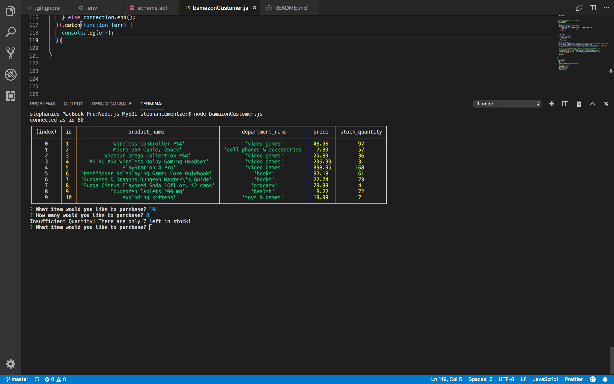
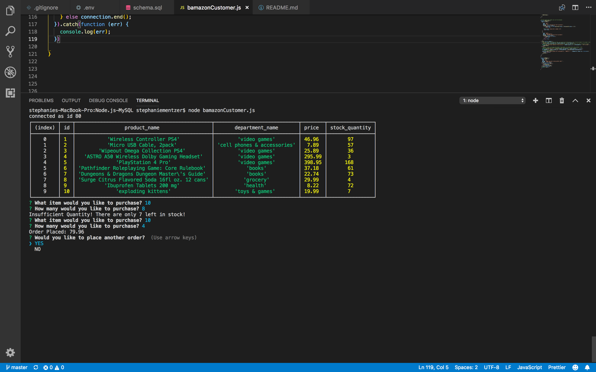
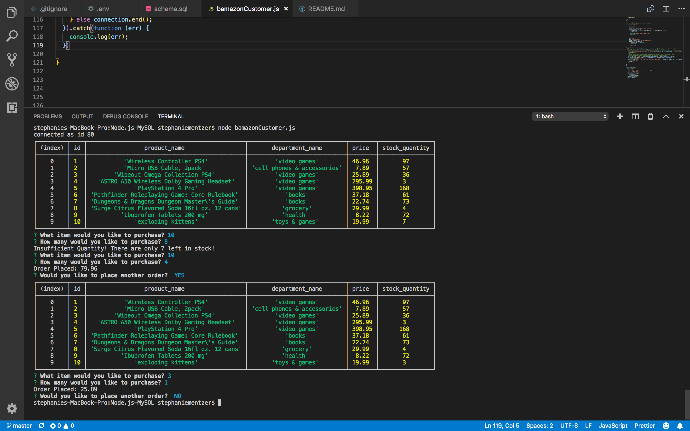
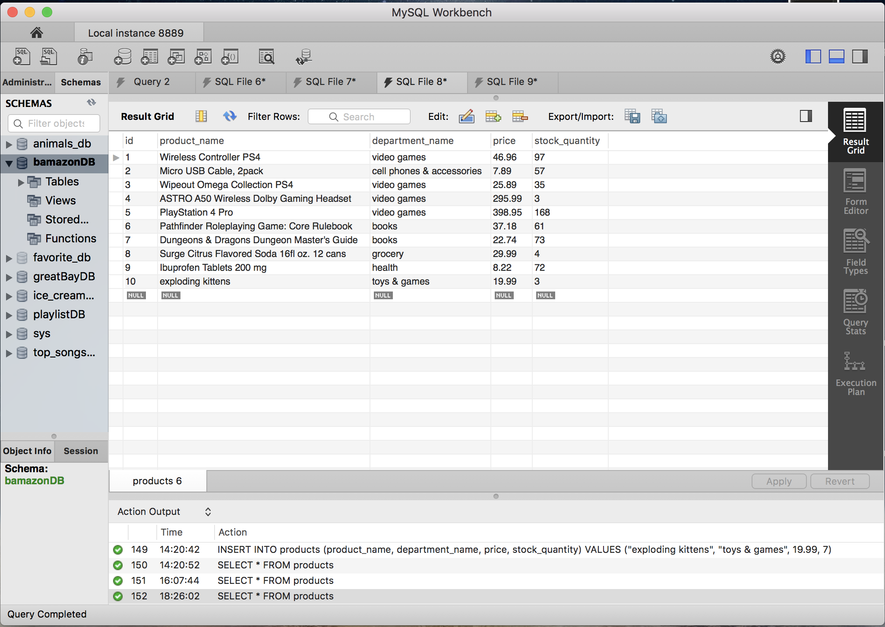

# Node.js-MySQL
Amazon-like storefront app using MySQL that will take in orders from customers and deplete stock from the store's inventory.

Bamazon in action:
-display all of the items available for sale

-Insufficient Quantity

-Order placed

-Second order

-Database updated 

